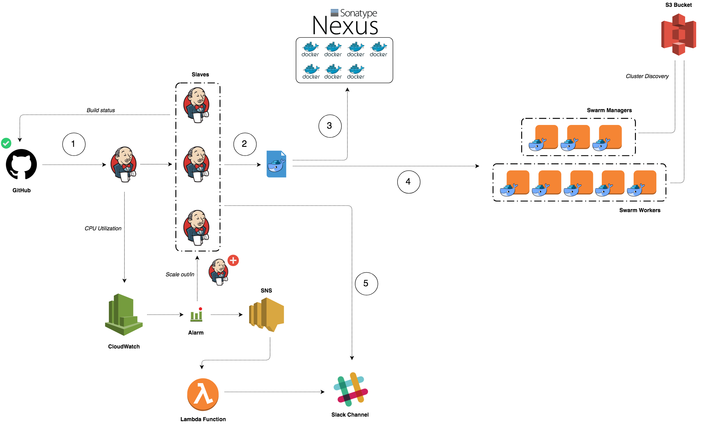
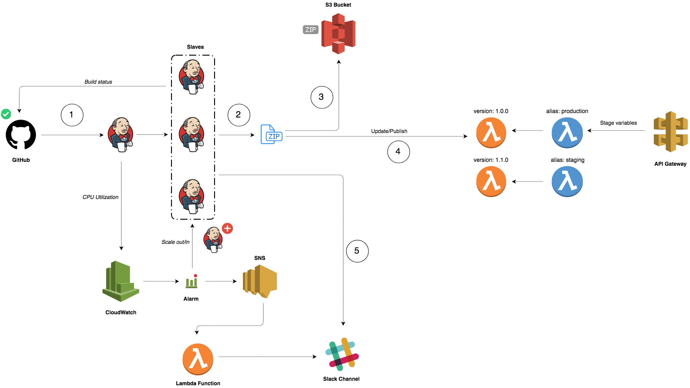

# CI/CD for Microservices and Serverless Functions in AWS

## Learning Objectives

* Core Concepts [[YouTube](https://www.youtube.com/watch?v=eAvxtPQVtDA)] [[Slides](https://fr.slideshare.net/medfreaky/cicd-for-microservices-and-serverless-functions-in-aws-core-concepts)]
* Build an AWS VPC using Infrastructure as Code [[YouTube](https://www.youtube.com/watch?v=1tD5moDGKHM)] [[Slides](https://fr.slideshare.net/medfreaky/cicd-for-microservices-and-serverless-functions-in-aws-build-an-aws-vpc-using-infrastructure-as-code)]
* Deploy a Highly available Jenkins cluster on AWS [[YouTube](https://www.youtube.com/watch?v=XCyiYoOZayI)] [[Slides](https://fr.slideshare.net/medfreaky/deploy-a-highly-available-jenkins-cluster-on-aws)]
* Manage a Private Docker Registry with Sonatype Nexus [[YouTube](https://www.youtube.com/watch?v=YqswOqE-kD4)] [[Slides](https://fr.slideshare.net/medfreaky/manage-a-secure-private-docker-registry-with-sonatype-nexus-and-acm)]
* Build a Docker Swarm cluster on AWS [[Slides](https://fr.slideshare.net/medfreaky/build-a-docker-swarm-cluster-on-aws)]
* Implement a CI/CD Pipeline for Containerized Microservices [[Slides](https://fr.slideshare.net/medfreaky/build-a-cicd-pipeline-for-dockerized-microservices-in-aws)]
* Implement a CI/CD Pipeline for Serverless Functions
* Deployment Strategy
* Integrate Security and Compliance into your CI/CD 
* Build a centralised monitoring and logging platform in AWS
* Wrap up and going further

## CI/CD for Dockerized Microservices

    

## CI/CD for Serverless Functions

    

